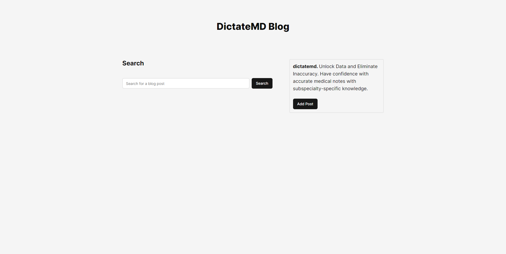
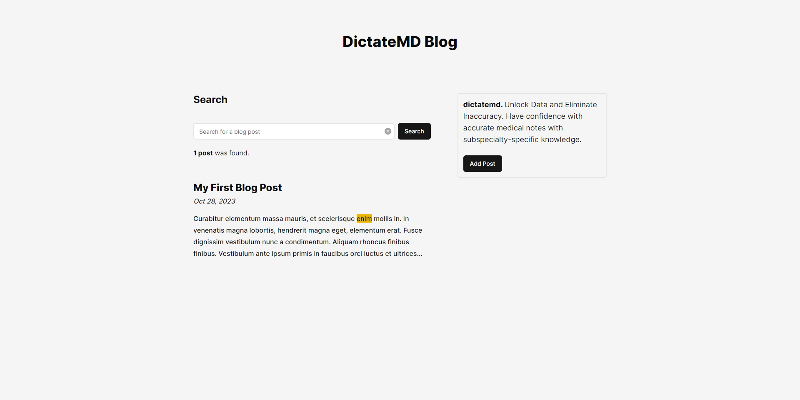
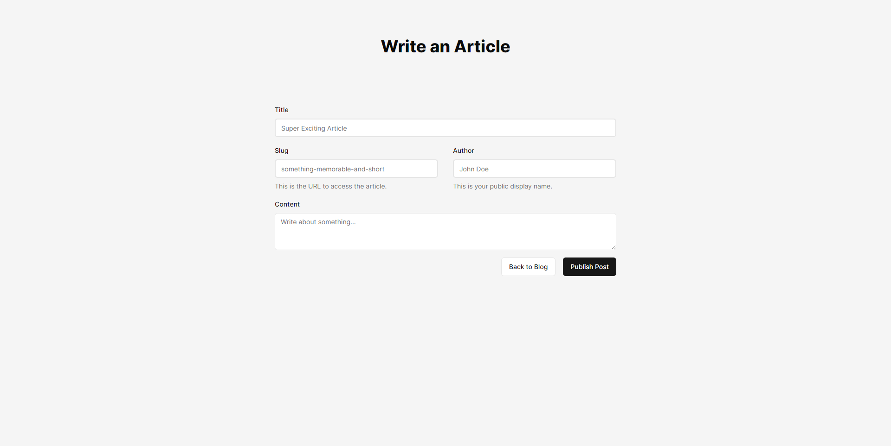

# Coderbyte Text Search

## Overview

This repository contains my submission for the Coderbyte take-home project: Text Search.

### Project Instructions

Your task is to create a search box where users can type in keywords or phrases, and your application returns results with the text being searched for highlighted. You can use any front-end framework you want (e.g. React, Angular, Vue.js, etc.). For the back-end, you can use the language and framework of your choice as well along with the database (MySQL, MongoDB, etc.)

Your application should store all the documents and text in the database and they should be fetched when the user types keywords in and presses a search button. Users can also add in their own documents via a UI with whatever properties they want, e.g. author, date, name, etc. Be sure to implement some sort of caching layer so the database is not accessed every single time users search for something. It should look something like the image below.


_Example Project_

### Project Screenshots





### Write up

When building this project, many simplifications were made, with the biggest one being that all the blog posts would be stored in plaintext format. By storing them in plaintext, it's much easier to index them and determine if they contain keywords users are searching for. However, the obvious tradeoff is the lack of support for rich text, meaning there would be no way to include text decoration, images, links, and other elements. Furthermore, the reliance on MongoDB's indexing algorithm, which is not recommended for large amounts of data, and keyword matching through RegEx, results in reduced application performance due to the lack of robust implementations.

Another area of simplification involves the server-side caching mechanism. After creating a new post, the cache update process is somewhat inefficient. The server retrieves all cache keys from Redis and iterates through them to find keys that contain keywords in the new post. If there are keywords, then the cache key's value is updated to include the new post.

In addition to using Redis for server-side caching, client-side caching was also implemented using react-query. This dual-caching method not only optimizes server performance but also reduces traffic to the Redis server, which contributes to a more efficient overall caching system.

## Tech Stack

- [Next.js](https://nextjs.org)
- [Prisma](https://prisma.io)
- [Tailwind CSS](https://tailwindcss.com)
- [tRPC](https://trpc.io)
- [Redis](https://redis.io)
- [MongoDB](https://mongodb.com)
- [Docker](https://docker.com)

## Getting Started

### Prerequisites

Make sure you have the following tools installed:

- [Node.js](https://nodejs.org/)
- [npm](https://www.npmjs.com/) (or [Yarn](https://yarnpkg.com/) if preferred)
- [Docker](https://www.docker.com/)

### Setup

1. Clone the repository:

   ```bash
   git clone https://github.com/tot/coderbyte-assessment.git

   ```

2. Change into the project directory:

   ```bash
   cd coderbyte-assessment
   ```

3. Install dependencies:

   ```bash
   npm install
   ```

4. Update environment variables. Rename the .env.sample file to .env

5. Build the docker container:

   ```bash
   docker-compose up
   ```

   > This command will build the docker container and start the MongoDB and Redis images.

6. Run the Next.js server:

   Development mode

   ```bash
   npm run dev
   ```

   Production mode

   ```bash
   npm run build
   ```

### Database Management

On project initialization and **after any modifications to `prisma.schema`**, make sure to generate database typings and update the database schema:

```bash
   npm run db:generate
```

```bash
   npm run db:push
```

To seed the database with initial posts:

```bash
npx prisma db seed
```

To open the Prisma studio to view the database, run the command:

```bash
npm run db:studio
```

To seed the database:

### Additional Scripts

- **npm run lint**: Run ESLint for code linting.
- **npm run build**: Build the Next.js application.
- **npm start**: Start the Next.js production server.
